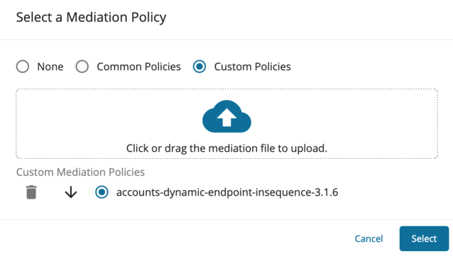

# Deploy NextGenPSD2XS2A API.

This document provides step by step instructions to deploy the NextGenPSD2XS2A API. 

!!! tip
    When the TPP provides an Account Information Service as an online service, the TPP is known as an Account Information Services Provider (AISP).

1. Sign in to the [API Publisher Portal](https://localhost:9443/publisher) with the credentials for `mark@gold.com`. 

2. In the homepage, go to **REST API** and select **Import Open API**. 

3. Select **OpenAPI File/Archive**. 

4. Click **Browse File to Upload** and select the `<APIM_HOME>/<OB_APIM_TOOLKIT_HOME>/repository/resources/apis/berlin.group.org/PSD2API_1.3.6/psd2-api_1.3.6_20200327.yaml` file.

5. Click **Next**.

6. Click **Create** to create the API. 

7. After the API is successfully created, go to **Portal Configurations** using the left menu panel. 

8. Select **Subscriptions** from the left menu pane and set the business plan to **Unlimited: Allows unlimited requests**. 

9. Click **Save**.

10. Toggle the **Schema Validation** button to enable Schema Validation for all APIs except for the Dynamic Client Registration API. 

11. Click the **Edit** button under **Request > Message Mediation**. 

12. Now, select the **Custom Policy** option.

13. Upload the `<APIM_HOME>/<OB_APIM_TOOLKIT_HOME>/repository/resources/apis/berlin.group.org/PSD2API_1.3.6/dynamic-endpoint-insequence-1.3.6.xml` insequence file. 
 
14. Click **Select**. 

15. Scroll down and click **SAVE**.

16. Use the left menu panel and go to **API Configurations > Endpoints**. 

17. Add a **Dynamic Endpoint**. 

18. Go to **Deployments** using the left menu pane. 

    
    
19. Select the API Gateway type, in this scenario, it is **Default**. 

20. Click **Deploy**.

21. Go to **Overview** using the left menu pane. 

    

22. Click **Publish**. 

### Summarized information for configuring APIs

Given below is a summary of configurations to follow when deploying the API in the toolkit.

| API | Swagger definition (yaml file) | Endpoint type| Message mediation (sequence file) |
|-----|--------------------------------|--------------|---------------------------------- |
| NextGenPSD2XS2A API v1.3.6 | `<APIM_HOME>/<OB_APIM_TOOLKIT_HOME>/repository/resources/apis/berlin.group.org/PSD2API_1.3.6/psd2-api_1.3.6_20200327.yaml` | Dynamic Endpoint | `<APIM_HOME>/<OB_APIM_TOOLKIT_HOME>/repository/resources/apis/berlin.group.org/PSD2API_1.3.6/dynamic-endpoint-insequence-1.3.6.xml` |