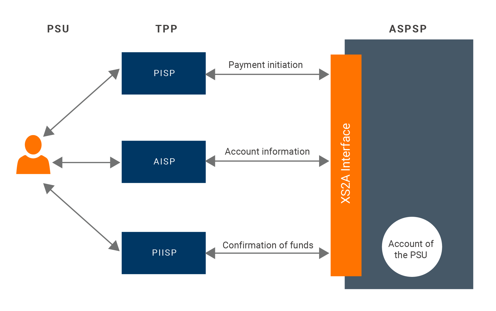

#TPP Onboarding

The TPPs can create OAuth 2.0 client applications to facilitate banking services exposed via Bank APIs. WSO2 Open Banking 
Berlin Toolkit provides the Client Registration feature to register the applications in the bank's back end. The TPP 
applications go through an in-depth verification during this process to make sure the application is authorized and 
secured before sharing customers’ financial data.

This verification includes a comprehensive sign-up process at the Developer portal of WSO2 API Manager. For a TPP to 
start providing open banking services, it has to be registered under a Competent Authority, which is a regulatory body 
that authorizes and supervises the open banking services delivered by the TPP. Once onboarded to the bank, the TPP 
application can generate a consumer key/client ID which can be used to communicate with the bank. 

The TPP Onboarding feature in the WSO2 Open Banking performs the following:

 - Validates if the TPP application is authorized by a competent authority
 - Validates information such as the role of the TPP, signature algorithm, authorization scopes, 
 OAuth2.0 grant types, application type, and the request issuance time
 - Allows registered TPP applications to access data via open banking APIs